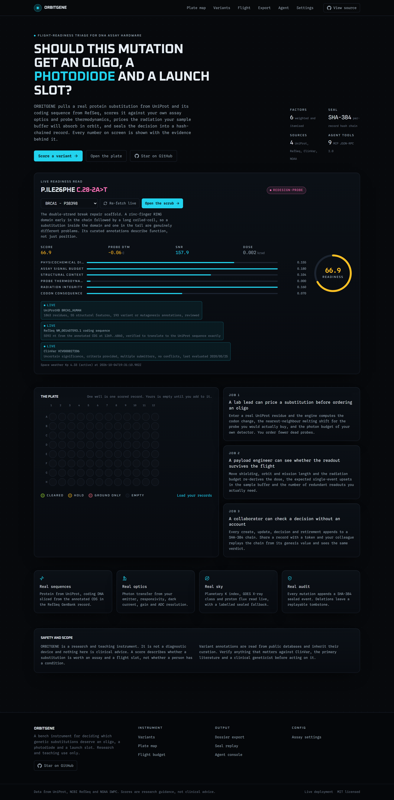
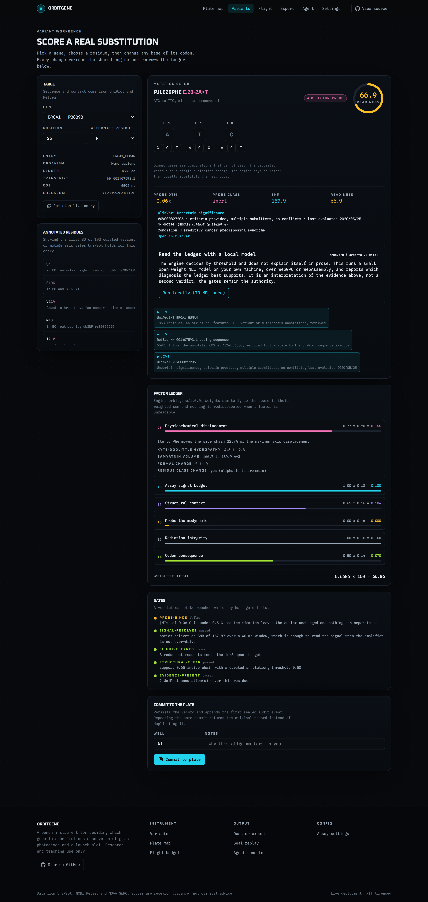
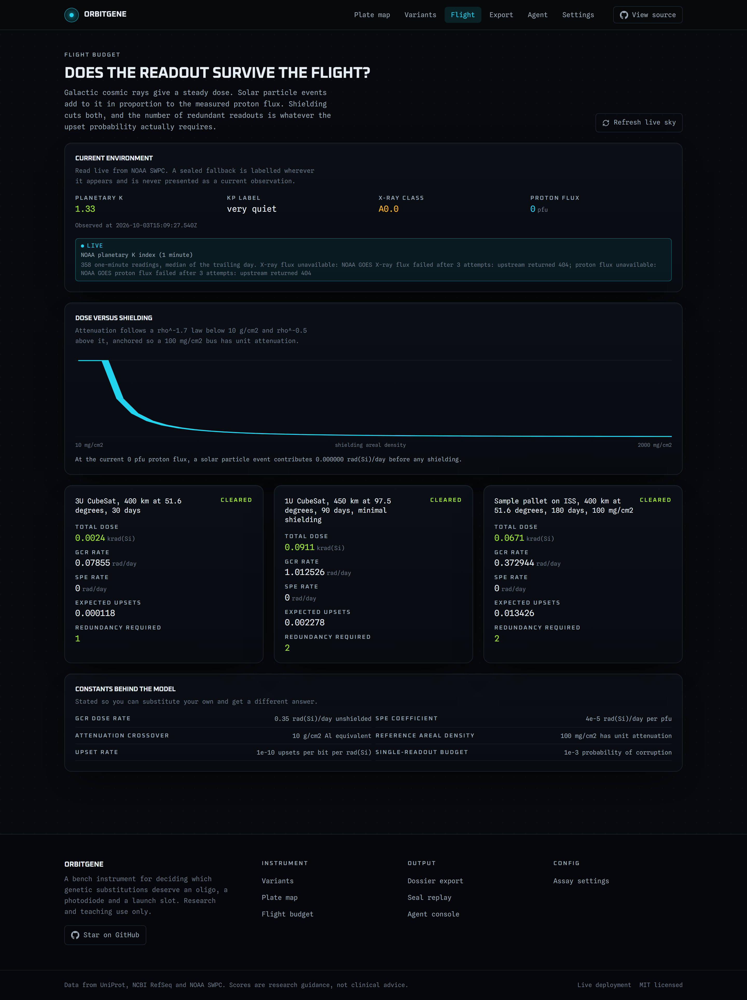
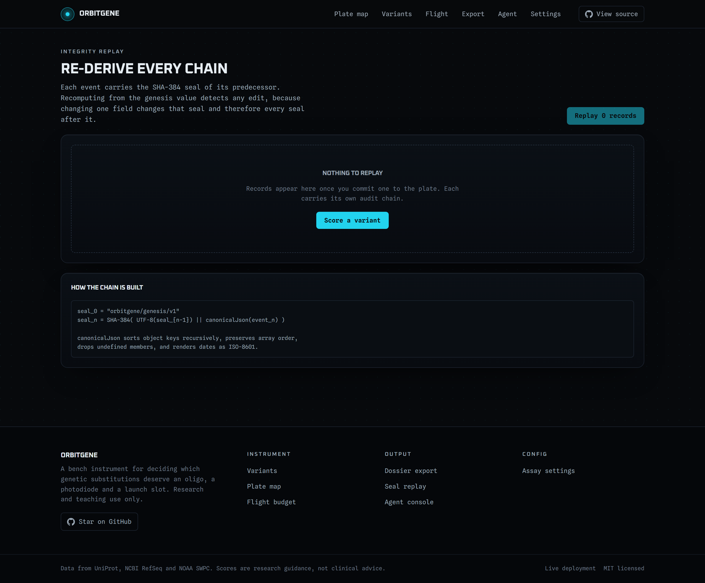
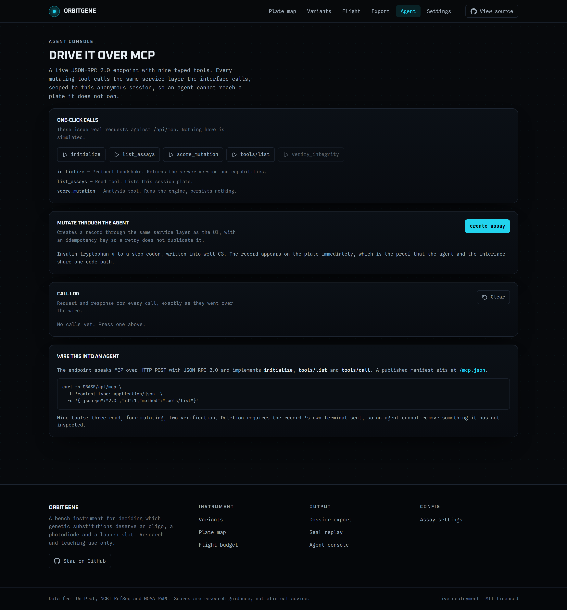
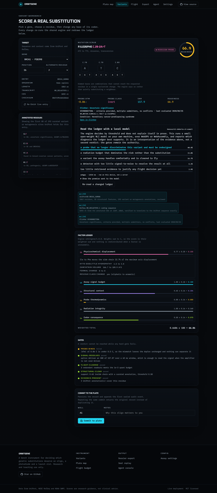

# ORBITGENE

**Flight-readiness triage for DNA assay hardware.**

You have a protein substitution and a real question: is it worth an oligo, a
photomultiplier, and a launch slot?

ORBITGENE retrieves the actual sequence from UniProt and RefSeq, finds the exact
ClinVar classification for that substitution, scores it against probe
thermodynamics and your detector optics, prices the radiation your sample buffer
will absorb in orbit, and seals the whole decision into a hash-chained record
you can hand to a collaborator.

Live: **[orbitgene.vercel.app](https://orbitgene.vercel.app)**
Code: **[github.com/aniruddhaadak80/orbitgene](https://github.com/aniruddhaadak80/orbitgene)**

No account. No API key. Nothing to sign up for.



---

## Try it in about twenty seconds



1. Open **[orbitgene.vercel.app/variants](https://orbitgene.vercel.app/variants)**.
2. Leave `BRCA1 - P38398`, position `26`, alternate residue `F`.
3. Read the gates. `probe-binds` fails, because a 21-mer with one mismatched base
   shifts the duplex melting temperature by **0.06 °C**, and nothing separates a
   0.06 °C difference.
4. Scrub any base of the codon. The engine re-runs and the ledger redraws.
5. Press **Run locally**. A 70 MB open-weight model downloads once and reads the
   ledger on your own GPU.

Or watch it happen against a gene whose clinical annotation is unambiguous:
`P04637`, position `175`, `R` → `H`.

## What it actually does

### Real sequences, verified against each other

The coding sequence is **not** the mRNA and **not** the gene. ORBITGENE fetches
the RefSeq GenBank record, reads the annotated `CDS` location out of it, and
extracts exactly those bases. It then accepts that sequence only when it
**translates to the UniProt protein exactly, residue for residue**.

That one check catches a whole family of silent bugs at once:

- a minus-strand gene whose CDS was read forwards instead of reverse-complemented,
- a truncated or frameshifted isoform,
- a transcript that belongs to a different gene,
- a wrapped GenBank qualifier that swallowed a coordinate.

It is why the app can say *"verified to translate to the UniProt sequence
exactly"* rather than *"loaded a sequence"*. UniProt entries rarely offer a single
transcript, so candidate `NM_` accessions are gathered from two independent
routes — the RefSeq cross-references in the UniProt flat file, and NCBI's
protein-to-mRNA link — and each candidate is tried until one translates cleanly.
BRCA1 resolves to `NM_001407593.1`, 5592 nt for 1863 residues.

### ClinVar for the substitution, not for the gene

`BRCA1[gene]` matches 16,094 variants, which tells you nothing about the one on
your plate. ClinVar indexes UniProt-style three-letter protein changes, so
ORBITGENE asks `TP53[gene] AND Arg175His` and gets one record:

| Substitution | ClinVar | Classification | Review status |
|---|---|---|---|
| TP53 R175H | `VCV000012374` | **Pathogenic** | reviewed by expert panel |
| EGFR L858R | `VCV000016609` | **drug response** | reviewed by expert panel |
| BRCA1 I26F | `VCV000827206` | Uncertain significance | multiple submitters, no conflicts |

The three outcomes are kept apart on purpose. `reported` is a classification we
retrieved. `not-reported` is ClinVar genuinely holding nothing. `unavailable` is
a failed lookup. Collapsing the last two would mean telling a reader that
ClinVar has nothing on a variant that nobody managed to ask about — which is
exactly what a rate-limited lookup looks like if you are not paying attention.

### A versioned, deterministic engine

`orbitgene/1.0.0`. Six weighted factors, five hard gates, one verdict.

| Factor | Weight | What it measures |
|---|---|---|
| Physicochemical displacement | 0.20 | Kyte-Doolittle hydropathy, volume, formal charge, residue class |
| Assay signal budget | 0.18 | Photon transfer, shot and dark noise, ADC quantum noise, gain and window |
| Structural context | 0.16 | Whether the residue sits in annotated helix, sheet or turn |
| Probe thermodynamics | 0.16 | Nearest-neighbour ΔG and ΔTm for the probe window you actually have |
| Radiation integrity | 0.16 | Shielded dose, single-event upsets, required voting redundancy |
| Codon consequence | 0.14 | Residue change, transition vs transversion, silent by synonymous accident |

Weights sum to 1, so the score is a weighted mean and nothing is redistributed
when a factor is unreadable. Gates are thresholds and they are the authority:
`FLIGHT-GO`, `GROUND-ONLY`, `REDESIGN-PROBE`, `HOLD-FOR-EVIDENCE`.

The score is **not** a black box. Every factor returns the numbers behind it —
ΔG in kcal/mol, SNR over a 40 ms window, dose in krad, the exact base that
changed — and every gate that fails states why in a sentence you can check.

Deterministic inputs produce a byte-identical response, and the verifier asserts
it. A score carries the version of the engine that produced it, because a score
without its version is not evidence.

### Radiation that is computed, not asserted

GCR and solar particle event dose rates, a shielding curve, the resulting dose
over a mission, expected single-event upsets in the sample buffer, and the
number of redundant readouts needed to push corruption probability below an
acceptable bound. Move the shielding slider and the budget re-derives.



When NOAA cannot be reached the page says so in place rather than substituting a
plausible number. The screenshot above caught GOES returning 404 while the
planetary K index still came through, and it reports exactly that.

### An audit chain you can actually replay

Every create, update, decision and retirement appends an event to a SHA-384 hash
chain and moves the seal forward. Retiring a record requires echoing its current
seal, and a **stale** seal is refused with `409` — so a tab left open all
afternoon cannot silently overwrite the state you are looking at.

Retirement leaves a tombstone rather than deleting the row, so the history stays
replayable afterwards. `/verify` replays any chain from its genesis value and
reports the first event that does not line up.



### ClinVar, UniProt, RefSeq and NOAA, each labelled

Every response names its sources and whether each was **live** or a **sealed
fallback**. A small set of accessions ships with bundled real sequences so the
app still works offline; for those the curated annotations are deliberately
empty, because a fallback that quietly returns invented evidence is worse than a
fallback that admits it is a fallback.

NOAA SWPC planetary K index, GOES X-ray class and >1 MeV proton flux are read
live. NOAA reports Kp as `estimated_kp`, `kp_index`, and labels such as `0P`; the
reader tries the numeric fields first, because `parseFloat("0P")` is `0` and a
quiet Sun looks like a storm.

### An MCP server, so an agent can use it too

Nine tools over JSON-RPC 2.0, annotated with `readOnlyHint` and idempotent where
that makes sense:

```
list_presets        get_space_weather    score_mutation
list_assays         get_assay            create_assay
record_decision     retire_assay         verify_integrity
```

A mutating call through MCP is stamped `actor: "agent"` and appends to the same
chain, so you can tell what a human did from what their agent did.

```json
{
  "mcpServers": {
    "orbitgene": {
      "type": "http",
      "url": "https://orbitgene.vercel.app/api/mcp"
    }
  }
}
```



### Open-source AI at the core, running on your machine

The engine is deterministic on purpose, which makes it trustworthy and
reviewable but bad at one job: explaining itself in prose. So the factor ledger
is handed to **`Xenova/nli-deberta-v3-xsmall`**, a 70 MB open-weight
natural-language-inference model, running in the browser through
`@huggingface/transformers` on **WebGPU**.



It answers one question: which of five diagnoses does this evidence best
support? On the BRCA1 example above it returns *"a probe that no longer
discriminates this variant and must be redesigned"* at 40.4%, which agrees with
the failed `probe-binds` gate — but that agreement is a result, not a
coincidence the UI is entitled to assume.

What it is **not**: a second opinion on the verdict. The gates are thresholds and
they remain the authority. The panel shows the exact premise text sent to the
model, so you can read the model's input and judge it yourself. It loads only
when asked, and if it fails, the score, the gates and everything else are
unaffected.

Why this matters, concretely: the weights are fetched once from a public CDN and
cached by your browser. Inference is **~4.5 seconds on a consumer GPU**, on your
machine, for **no API key and no cost per run**, and **no assay data leaves the
device**. It keeps working with the network unplugged once cached. Nothing about
a user's sequence, notes or records is ever sent to a server to be classified.

## Verify it yourself

```bash
git clone https://github.com/aniruddhaadak80/orbitgene
cd orbitgene
npm install
npm run dev            # no DATABASE_URL needed
```

`npm run dev` runs an embedded Postgres (PGlite) inside the Node process. No
database to install, no connection string, no account.

```bash
npm run typecheck      # tsc --noEmit
npm run lint
npm test               # 171 unit tests, no network
npm run build
```

Then drive the real HTTP surface, including MCP, idempotency, seal conflicts,
replay and cross-session isolation:

```bash
npm run verify:live -- http://localhost:3000
npm run verify:live -- https://orbitgene.vercel.app
```

Isolating an upstream outage from a bug in this repository:

```bash
npm run probe:sources   # which catalogue genes currently resolve from UniProt/RefSeq
npm run probe:store     # is the embedded store healthy
npm run test:browser    # does the local model really run (downloads ~70 MB)
```

`npm run test:browser` is deliberately not in CI. It fetches 70 MB of weights and
needs a GPU or WASM runtime, so it would be slow and flaky as a gate.

## Architecture

```
src/lib/genetics.ts      codon table, substitutions, HGVS, residue scales
src/lib/thermo.ts        SantaLucia nearest-neighbour probe thermodynamics
src/lib/radiation.ts     shielding, dose, upset and voting model
src/lib/engine.ts        the versioned engine: factors, gates, verdict
src/lib/integrity.ts     canonical JSON, SHA-384 chain, replay
src/lib/sources/         UniProt, NCBI RefSeq + ClinVar, NOAA, sealed fallback
src/lib/db/              Neon and PGlite behind one interface, migrations
src/lib/mcp-tools.ts     MCP tool schemas and handlers
src/components/verdict-explainer.tsx   the local open-weight model
scripts/verify-live.mjs  91 end-to-end checks against a running deployment
```

Two persistence backends sit behind one interface. Production runs Neon
Postgres; local and CI run PGlite in-process. `ORBITGENE_STORE=pglite` makes
that explicit, and a production build without `DATABASE_URL` refuses to start
rather than quietly serving a throwaway store — `/api/health` reports
`durable: false` whenever it is running on the embedded one.

## What it is not

ORBITGENE is a research and teaching instrument. **It is not a diagnostic device
and nothing here is clinical advice.** A score says whether a substitution is
worth an assay and a flight slot, not whether a person has a condition. Variant
annotations inherit the curation of public databases; verify anything that
matters against ClinVar, the primary literature, and a clinical geneticist.

Radiation constants are order-of-magnitude engineering estimates suitable for
triage and teaching, not for qualifying hardware. There is no ADEC or TID
qualification here.

## Contributing

See [CONTRIBUTING.md](CONTRIBUTING.md). The short version: the engine is a
contract, so changing a weight, threshold, factor or gate means bumping the
version. Never synthesise an annotation that was not retrieved. Never mutate a
sealed record. Show the evidence. Add the test that was red before your fix was
green.

Security notes, including the known gaps, are in
[SECURITY.md](SECURITY.md).

## License

MIT. Data from UniProt, NCBI RefSeq, ClinVar and NOAA SWPC, each under its own
terms.